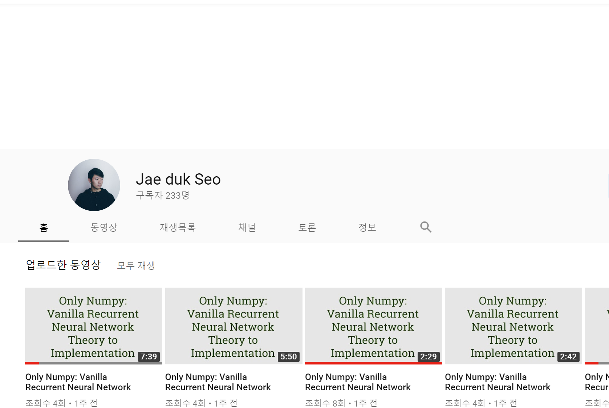

# Only-Numpy

[](https://circleci.com/gh/JaeDukSeo/Only_Numpy_Basic)

<!-- [](https://waffle.io/hack4impact/flask-base)

[](https://codeclimate.com/github/hack4impact/flask-base/coverage)

[](https://codeclimate.com/github/hack4impact/flask-base)  -->


Implementing varity of Neural Network Algorithms only using Numpy Library, and maybe Sklearn (only to generate training data.)

** I MOVED THIS REPO TO GITLAB [https://gitlab.com/jae.duk.seo/Only_Numpy](https://gitlab.com/jae.duk.seo/Only_Numpy)

**For more tutorial Visit my website:  [https://jaedukseo.me/](https://jaedukseo.me/).**<br />
**For more tutorial Visit my You Tube Channel:  [https://www.youtube.com/c/JaeDukSeo](https://www.youtube.com/c/JaeDukSeo).**<br />
**Also, Follow me on Twitter:  [https://twitter.com/JaeDukSeo](https://twitter.com/JaeDukSeo).**<br />
**Also, Follow me on Medium:  [https://medium.com/@SeoJaeDuk](https://medium.com/@SeoJaeDuk).**<br />


## What's included?

** I MOVE TO GITLAB : https://gitlab.com/jae.duk.seo/Only_Numpy


* ANN Basic And Gate
* ANN Basic Constant Learning Rate
* ANN Basic Constant Step Decay
* RNN without Activation Function
* RNN with Activation Function
* Sythentic Gradient 
* Sythentic Gradient (Multi Threaded)


## Youtube Channel

* I have a Youtube channel where I try to explain things follow this [Link](https://www.youtube.com/c/JaeDukSeo) <br />



## Medium Explanation Posts

[Only Numpy: Deriving Forward feed and Back Propagation in Synthetic Gradient (Decoupled Neural Interfaces) with Interactive Code feat. iamtrask](https://medium.com/@SeoJaeDuk/only-numpy-deriving-forward-feed-and-back-propagation-in-synthetic-gradient-decoupled-neural-ca4c99666bbf)


[Only Numpy: Vanilla Recurrent Neural Network Deriving Back propagation Through Time Practice](https://medium.com/@SeoJaeDuk/only-numpy-vanilla-recurrent-neural-network-back-propagation-practice-math-956fbea32704)


## Setting up

##### Clone the repo

```
$ git clone https://github.com/JaeDukSeo/Only_Numpy_Basic
$ cd Only_Numpy_Basic
```

##### Choose the NN type you wish to run and go into repo

```
$ cd 2_Decoupled_Neural_Network
```

##### run the code in ptyhon3

```
$ python3 1_Red_Box_Case
```

## License
[MIT License](LICENSE.md)
